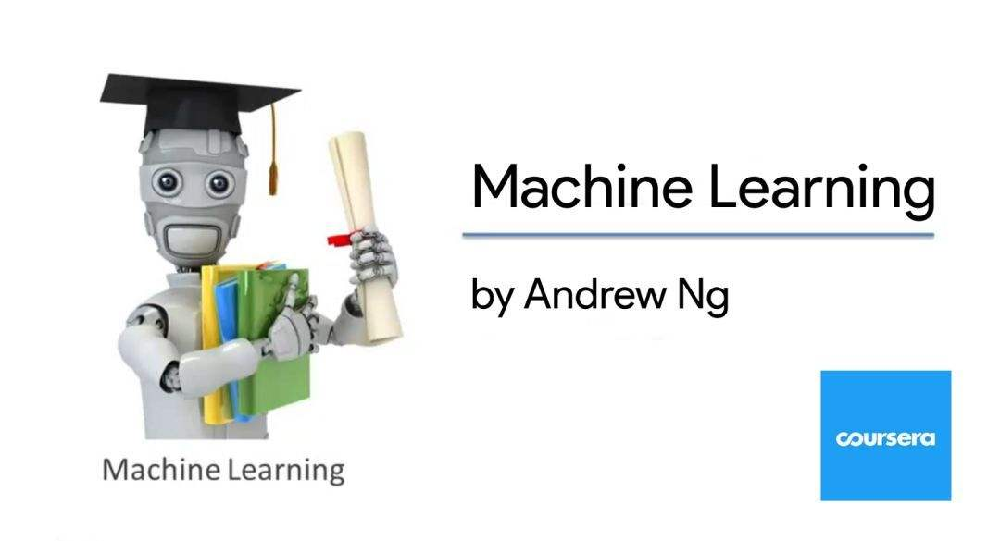

# 课程



**Course supported by ：**[coursera.org](https://www.coursera.org/learn/machine-learning/home/welcome)

# 食用方法

- 这是一门入门课！吴恩达老师采用的编程语言是 **octave**

- 吴恩达老师的讲解涉及极少的数学理论基础，因此显得十分通俗易懂。如果需要加深对数学理论的理解，推荐李航老师的《统计学习方法》，个人也在啃这本书，写了一点关于这本书的理解和代码实现，欢迎访问 [我的笔记](https://github.com/tsuirak/Statistical-Learning-Methods-lihang)

- 每门课后都会有 **assignment** ，个人的课后实验习题是基于 **numpy** 和 **sklearn** 完成的，请一定要自己动手去实现

- 目录文件结构

  ```
  ├─ML_by_Stanford_AndrewNg
  	├─Labs # 课后实验
  		├─W1-assignment-Linear Regression # 线性回归
      ├─W2-assignment-Logistic Regression # 逻辑回归
  		├─W3-assignment-Multiply Classification # 多分类
  		├─W4-assignment-Neural Network # 神经网络
      ├─W5-assignment-Bias Vs Variance # 偏置与方差
      ├─W6-assignment-Support Vector Machines # 支持向量机
      ├─W7-assignment-K-Means And PCA # K均值聚类算法和主成分分析
      ├─W8-assignment-Anomaly Detection And Recommendation # 异常检查和推荐算法
  ```

  

# 联系方式

- 邮箱：tsuiraku@126.com


# 参考

- [fengdu78.github](https://github.com/fengdu78/Coursera-ML-AndrewNg-Notes)

