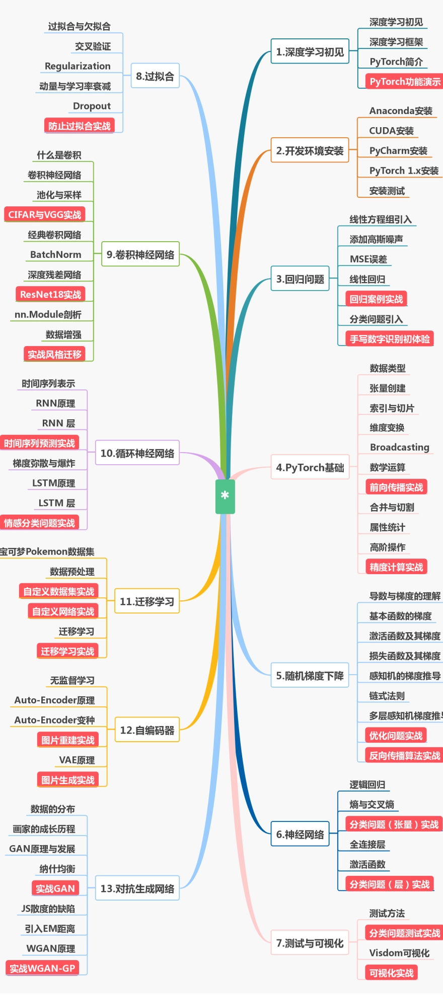

# 课程


**Code supported by ：**[dragen1860](https://github.com/dragen1860)

**Course supported by ：**[study.163.com](https://study.163.com/course/introduction.htm?share=2&shareId=480000001847407&courseId=1208894818&_trace_c_p_k2_=8a8366d9089e4893bd047e62)

# 食用方法

- 选择**pytorch**作为深度学习的框架，如若了解**tensorflow**，可以联想对比一下两者的异同处，个人觉得**tensorflow2**和**pytorch**十分类似
- 配置环境切记一定要耐心仔细，遇到问题先 google
- 涉及基础的机器学习以及深度学习的知识，需要了解每种网络的结构以及使用**pytorch**构建的方法
- 注重实战的课程，代码请务必手写
- 目录文件结构

```
├─Pytorch_learn_by_dragen1860
	├─datasets # 数据集
	├─images   # 图片
	└─slide    # 课件
	└─static   # visdom的static文件
	└─lesson.ipynb # 课程代码笔记
```


- 课程大纲




# 问题


## 配置cuda环境

[参考博客](https://blog.csdn.net/Mind_programmonkey/article/details/99688839)

## 启动visdom服务后长时间无反应

用于解决`visdom`服务启动时提示`Downloading scripts, this may take a little while`的问题

```cmd
Microsoft Windows [版本 10.0.18363.657]
(c) 2019 Microsoft Corporation。保留所有权利。

C:\Users\UserName>python -m visdom.server
D:\Anaconda3\lib\site-packages\visdom\server.py:39: DeprecationWarning: zmq.eventloop.ioloop is deprecated in pyzmq 17. pyzmq now works with default tornado and asyncio eventloops.
  ioloop.install()  # Needs to happen before any tornado imports!
Checking for scripts.
Downloading scripts, this may take a little while
```

### 解决方法：

1.找到`visdom`模块的安装位置，其位置位于`python`或`anaconda`安装目录下面`\Lib\site-packages\visdom`

文件目录结构：

```
├─static
│  ├─css
│  ├─fonts
│  └─js
├─__pycache__
├─__init__.py
├─__init__.pyi
├─py.typed
├─server.py
└─VERSION
```

2.修改文件`server.py` 修改函数`download_scripts_and_run`，注释`download_scripts()` 该函数位于全篇末尾，1917行，如下图所示：

```python
def download_scripts_and_run():
    # download_scripts()
    main()


if __name__ == "__main__":
    download_scripts_and_run()
```

3.下载新的`static`文件  将文件整体覆盖`\Lib\site-packages\visdom\static`

点击下载新的[static](https://github.com/tsuirak/skills/tree/master/Pytorch/Pytorch_learn_by_dragen1860/static)文件


## 运行visdom.server抛出NotImplementedError异常

```cmd
C: \Users\UserName>python —m visdom. server
D:\Anaconda3\lib\site-packages\visdom\server.py:39: DeprecationWarning: zmq.eventloop.ioloop is deprecated in pyzmq 17. pyzmq now works with default tornado and asyncio eventloops.
  ioloop.install() # Needs to happen before any tornado imports!
Checking for scripts.
It's Alive!
Traceback (most recent call last) :
...
...
...
raise NotImplementedError
```

#### 原因：Python3.7升级至3.8后使用出现异常

### 解决方法：

配置`asyncio`：

`asyncio.set_event_loop_policy(asyncio.WindowsSelectorEventLoopPolicy())`

1.找到`visdom`模块的安装位置，其位置位于`python`或`anaconda`安装目录下面`\Lib\site-packages\visdom`

文件目录结构：

```
├─static
│  ├─css
│  ├─fonts
│  └─js
├─__pycache__
├─__init__.py
├─__init__.pyi
├─py.typed
├─server.py
└─VERSION
```

2.打开`visdom`的`server.py`文件，配置`asyncio`，如下图所示：

```python
import asyncio
asyncio.set_event_loop_policy(asyncio.WindowsSelectorEventLoopPolicy())

if __name__ == "__main__":
    download_scripts_and_run()
```


# 联系方式

- 邮箱：tsuiraku@126.com


# 参考

- ### 请支持正版！[课程来源网址](https://study.163.com/course/introduction.htm?share=2&shareId=480000001847407&courseId=1208894818&_trace_c_p_k2_=8a8366d9089e4893bd047e)

- ### 参考龙老师，[原课件及其代码](https://github.com/dragen1860/Deep-Learning-with-PyTorch-Tutorials)

