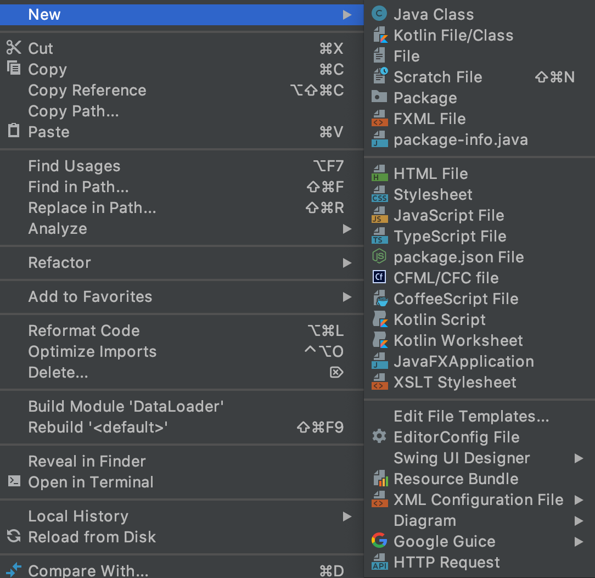

# 课程

**Course supported by ：**[atguigu.com](https://www.bilibili.com/video/BV11A411L7CK?p=11)

# 食用方法

- 目录文件结构

```

```


- 课程大纲


# 问题：


## 解决idea中无法创建Scala class

用于解决无法新new Scala Class，如下图所示：




### 解决方式：[参考博客](https://blog.csdn.net/m0_49337600/article/details/110443613)


## log4j配置后无法使得控制台停止显示日志

### 主要原因：

可能是因为拷贝PDF中的代码不正确导致

### 解决方法：

使用下面的代码：

```
log4j.rootCategory=ERROR, console
log4j.appender.console=org.apache.log4j.ConsoleAppender
log4j.appender.console.target=System.err
log4j.appender.console.layout=org.apache.log4j.PatternLayout
log4j.appender.console.layout.ConversionPattern=%d{yy/MM/dd HH:mm:ss} %p %c{1}: %m%n
# Set the default spark-shell log level to ERROR. When running the spark-shell, the
# log level for this class is used to overwrite the root logger's log level, so that
# the user can have different defaults for the shell and regular Spark apps.
log4j.logger.org.apache.spark.repl.Main=ERROR
# Settings to quiet third party logs that are too verbose
log4j.logger.org.spark_project.jetty=ERROR
log4j.logger.org.spark_project.jetty.util.component.AbstractLifeCycle=ERROR
log4j.logger.org.apache.spark.repl.SparkIMain$exprTyper=ERROR
log4j.logger.org.apache.spark.repl.SparkILoop$SparkILoopInterpreter=ERROR
log4j.logger.org.apache.parquet=ERROR
log4j.logger.parquet=ERROR
# SPARK-9183: Settings to avoid annoying messages when looking up nonexistent UDFs in SparkSQL with Hive support
log4j.logger.org.apache.hadoop.hive.metastore.RetryingHMSHandler=FATAL
log4j.logger.org.apache.hadoop.hive.ql.exec.FunctionRegistry=ERROR
```

### 解决方法：[参考视频p10](https://www.bilibili.com/video/BV11A411L7CK?p=11)


## IDEA编写Scala代码时自动显示变量类型

### 解决方法：[参考博客](https://blog.csdn.net/m0_49337600/article/details/110501827)


# 联系方式

- 邮箱：[tsuiraku@126.com](mailto:tsuiraku@126.com)

